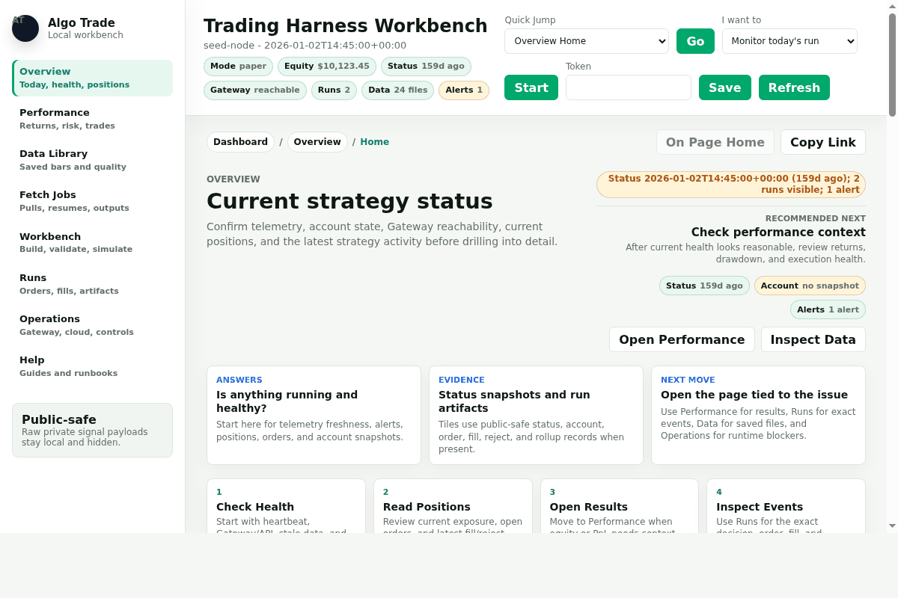

# IBKR Trading Harness

Local-first infrastructure for running strategy plugins against IBKR data with
explicit safety boundaries. The contribution is the harness: replay, shadow,
simulated-paper, and confirmed paper execution are separate modes, each with
separate artifacts and observable runtime state.

In 10 seconds:

- **Harness:** plugin runners record decisions, orders, fills, account snapshots,
  validations, and run artifacts.
- **Safety model:** broker authority is opt-in; paper/live order submission is
  gated by config, runtime flags, limits, and audit trails.
- **Observability:** the dashboard shows run health, data quality, performance,
  artifacts, Gateway state, and public-safe status telemetry.
- **Public boundary:** example strategies are intentionally non-viable; tuned
  signals, credentials, account data, and logs stay private.

<!-- After publishing, enable the CI badge by replacing OWNER/REPO:
 -->



## Try It In 30 Seconds

```bash
pip install -r requirements.txt
python3 scripts/demo_dashboard.py
```

This serves the full dashboard at `http://127.0.0.1:8765/` seeded with
public-safe example telemetry, saved bars, and a fetch manifest — no broker
connection, credentials, or token required. Everything you see is the same UI
a real deployment uses; only the data is synthetic.

For public posting and feedback collection, see `docs/public_launch_plan.md`.

The public version is intentionally strategy-neutral. It includes non-viable example strategies,
the harness, broker adapter, plugin interfaces, and Gateway service wrapper.
Real strategies, tuned parameters, account config, logs, and research artifacts
should live in a private repo or ignored local files.

## What This Is

- IBKR historical data fetch tooling for equities and Zero Hash crypto.
- A broker adapter that can be used by paper/live integrations.
- A generic strategy-plugin runner for replay, shadow, simulated-paper, and
  explicitly confirmed IBKR paper mode.
- A generic local supervisor that can schedule one or more plugin-runner jobs
  from public-safe config.
- Strategy plugin contracts for generic, stock, and crypto runners.
- Runnable textbook example strategies (SMA crossover, RSI mean reversion,
  opening-range breakout) plus an empty template — illustrative, no edge claimed.

## What This Is Not

- Not a profitable strategy.
- Not financial advice.
- Not a turnkey live-trading system.
- Not a place to store broker credentials or private strategy configs.
- Not a release of the private strategy runners or tuned signals.

## Operational Extras

The repo also includes a sanitized status publisher, token-authenticated
receiver, allowlisted remote command worker, and example cloud deployment files.
Those pieces are optional monitoring/ops infrastructure around the local
harness; they are not required for the 30-second demo or the core plugin-runner
workflow.

## What You Can Do With It

Five core workflows, each with a dashboard page built around it.

### 1. Watch a strategy run

Point the status publisher at your runner's artifacts and the **Overview**
page answers "is anything running and healthy?" at a glance: equity with a
sparkline, mode, Gateway reachability, latest signal/bar/fill, open positions,
and alerts. Every alert is a card that explains what it means, what to do,
and links to the page where the fix lives — alerts recompute from telemetry
each publish and clear themselves when the condition resolves.

```bash
python3 scripts/publish_status.py --config config/cloud_status.example.yaml --json
```

### 2. Read performance honestly

The **Performance** page leads with charts derived from the same data as its
tables: an equity curve, drawdown, cumulative and per-trade realized PnL, and
month/year return bars. A Strategy selector switches between publishing runs;
clicking any day in the rollup table re-windows every chart, KPI, and trade
row to exactly that day. Trade rows are paired from sanitized fills, so win
rate and profit factor come from real round trips, not summaries.

### 3. Pull and trust historical data

```bash
python3 live/fetch_history.py --host 127.0.0.1 --port 4002 --client-id 99 \
  --symbols SPY,QQQ --bar-size 5min --duration "1 D" --rth

python3 live/fetch_crypto_history.py --host 127.0.0.1 --port 4002 \
  --client-id 199 --symbols BTC-USD,ETH-USD --exchange ZEROHASH \
  --bar-size 1min --months 1
```

Fetches write resumable JSON manifests that the **Fetch Jobs** page renders:
progress by symbol and chunk, rolling ETA, retries, and output paths. Failed
or partial pulls resume with `--resume-manifest <manifest.json>`. The **Data
Library** indexes every saved file by root with fair-share scan budgets, and
its Symbol Visibility diagnostic explains exactly why a symbol is visible,
capped, unparsed, or missing.

### 4. Replay a strategy on saved data

In the **Workbench**: select saved files, preview timestamp alignment, pick a
plugin, generate a draft config, validate it, and run a replay — results land
in **Performance** and **Runs** as sanitized artifacts. The same flow works
headless:

```bash
python3 live/plugin_runner.py --config config/plugin_runner.example.yaml --validate-only
python3 live/plugin_runner.py --config config/plugin_runner.example.yaml --mode replay --max-steps 3
python3 scripts/summarize_plugin_run.py paper_logs/example_plugin_runner
```

Three runnable textbook examples ship ready to go on bundled synthetic data —
each produces one clean round trip you can open in Performance and Runs:

```bash
python3 -m live.plugin_runner --config config/sma_crossover.example.yaml
python3 -m live.plugin_runner --config config/rsi_mean_reversion.example.yaml
python3 -m live.plugin_runner --config config/opening_range_breakout.example.yaml
```

Validation instantiates your plugin and checks the runner contract before
anything runs. Runs write `decisions.jsonl`, `orders.jsonl`, `fills.jsonl`,
`account.jsonl`, and `summary.json`; execution guards (allowed symbols/sides,
max orders/quantity/notional, gross exposure, optional per-order approval)
apply before any simulated or paper order. IBKR paper mode additionally
requires an explicit `--confirm-paper-orders`.

### 5. Monitor from anywhere, safely

The receiver/dashboard runs locally by default. To check on a strategy away
from the machine, deploy the same receiver to a small cloud host with a
required bearer token, and point the publisher at it — the cloud host stores
only sanitized telemetry, never broker credentials or order authority:

```bash
export TRADING_STATUS_TOKEN='replace-me'
python3 scripts/cloud_status_server.py --config config/cloud_status_hosted.example.yaml
python3 scripts/publish_status.py --config config/cloud_status.example.yaml \
  --endpoint https://your-receiver/status --token-env TRADING_STATUS_TOKEN
```

An optional command worker polls the receiver outbound for a small allowlist
of read-only commands, writes hash-chained audit rows, and refuses reserved
high-risk actions (enabling live orders, flattening live positions) even if
they are added to the allowlist. Deployment templates for Docker/compose,
nginx, Caddy, Fly.io, Render, and provider firewalls are in `ops/cloud/`; the
walkthrough is `docs/cloud_monitoring_deployment.md`.

## Getting Started With Real Data

```bash
python3 -m venv .venv
source .venv/bin/activate
pip install -r requirements.txt
```

New to IBKR? `docs/ibkr_account_setup.md` covers why IBKR, picking a tier
(Lite vs Pro), market-data subscriptions, enabling crypto, and API access.

1. Start IB Gateway (paper) on port 4002 — `scripts/start_ibgateway_paper.sh`
   wraps IBC, and `docs/ibkr_gateway_runbook.md` covers login and service
   setup.
2. Fetch some bars (use case 3 above).
3. Serve the dashboard against your data and status:

```bash
scripts/install_local_monitoring_stack.sh   # user services: receiver + publisher timer
# or run it directly:
python3 scripts/cloud_status_server.py --config config/cloud_status.example.yaml
```

4. Open `http://127.0.0.1:8765/`. The Help view recommends a next route from
   your current setup state; the topbar "I want to" selector routes jobs like
   "monitor today's run" or "build a simulation" to the right page.
5. Replay a plugin on your fetched data (use case 4 above).

The full walkthrough — including supervisor scheduling, paper-mode rules, and
troubleshooting — is `docs/public_quickstart.md`.

## Strategy Plugins

Public examples live in `examples/strategies/` (see its
[README](examples/strategies/README.md)). They are non-viable demonstrations of
well-known textbook patterns — SMA crossover, RSI mean reversion, and
opening-range breakout, plus an empty `no_edge_template` — with no claimed edge.
A private strategy implements the same contract and is referenced from an
ignored local config:

```yaml
metadata:
  strategy_plugin: examples.strategies.sma_crossover:create_strategy      # public example
  # strategy_plugin: your_private_package.your_strategy:create_strategy   # private plugin
```

`pip install .` exposes the `framework` package (plugin contracts, loader,
market calendar) and the example plugins for import from your own code.

## Config Privacy

Commit only example files (`config/*.example.yaml`, `config/*.env.example`).
Never commit `config/*.env`, tuned configs or universes, logs, caches,
broker credentials, or private strategy plugins.

Run the publish gate before sharing any copy of this repo:

```bash
python3 scripts/public_publish_check.py
```

The gate bundles export-manifest review, the strict readiness audit, docs and
cloud-example audits, dashboard/Workbench contract audits, compile and syntax
checks, pytest, and dashboard smokes. `scripts/export_public_repo.py --force`
regenerates this public subset from a private tree; repeated exports preserve
the destination `.git`. See `docs/configuration_privacy.md` and
`docs/publication_readiness.md`.

## Documentation

- `docs/public_quickstart.md` — full setup and operations walkthrough
- `docs/web_ui_runbook.md` — dashboard usage, page by page
- `docs/ui_use_cases.md` — the use cases and design rules behind the UI
- `docs/cloud_monitoring_deployment.md` — hosted receiver deployment
- `docs/ibkr_account_setup.md` — IBKR tiers, market data, crypto, API setup
- Runbooks: `docs/ibkr_gateway_runbook.md`, `docs/paper_trading_runbook.md`,
  `docs/market_data_permissions_runbook.md`, `docs/service_restart_runbook.md`,
  `docs/failed_order_diagnosis_runbook.md`
- `docs/configuration_privacy.md`, `docs/publication_readiness.md`,
  `docs/public_framework_roadmap.md`, `docs/work_queue.md`

## License

MIT — see `LICENSE`. This is infrastructure, not alpha; nothing here is
financial advice or a viable trading strategy.
