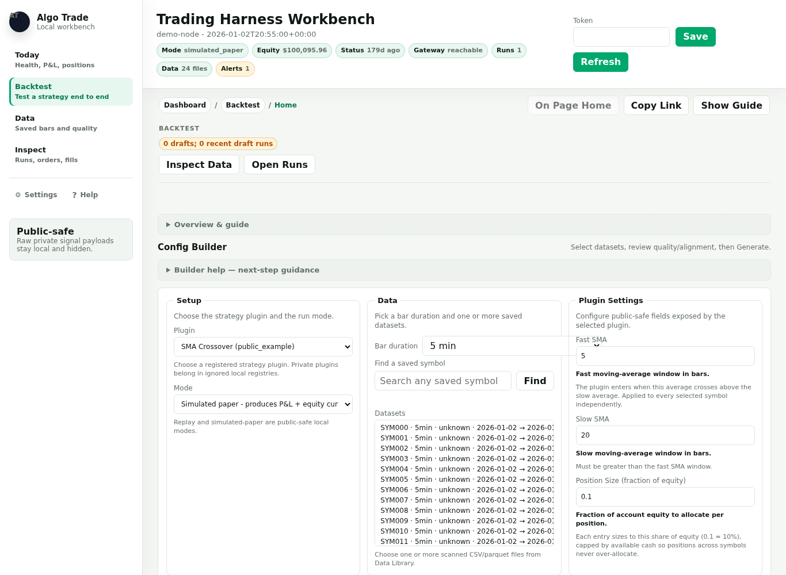
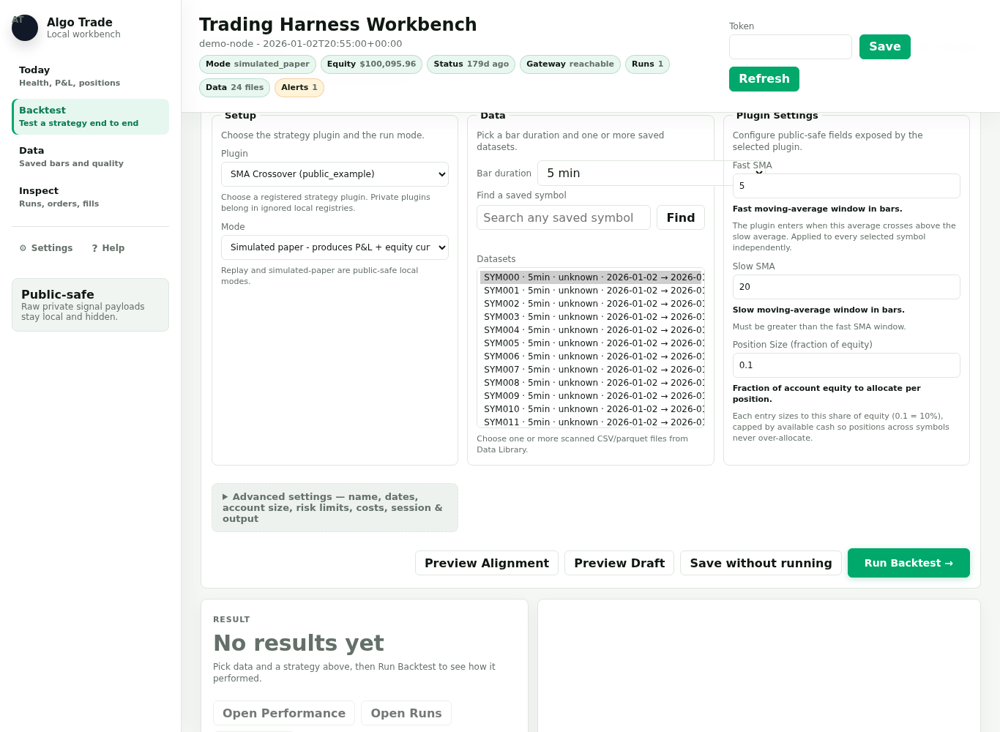
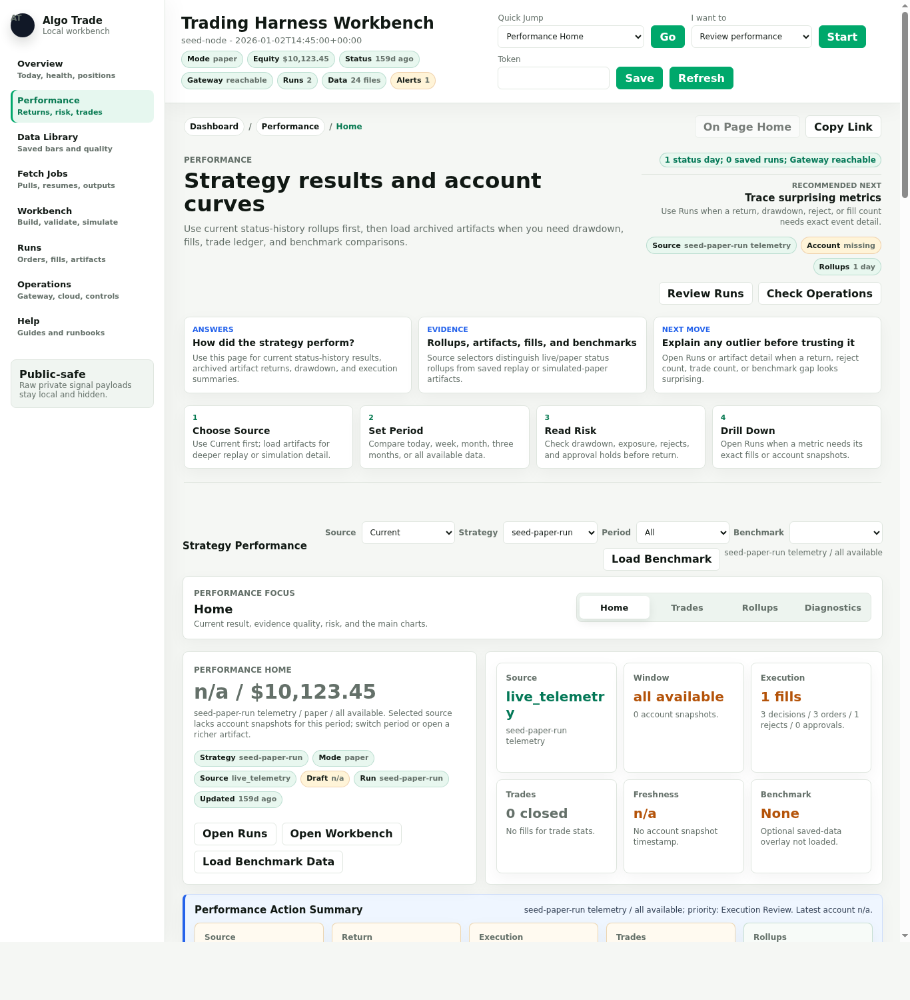
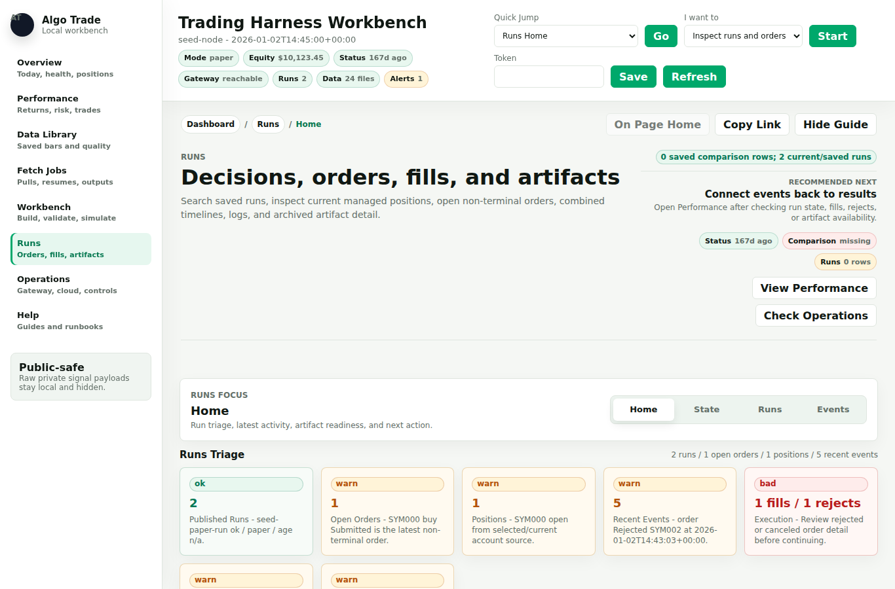

# Workbench Backtest Walkthrough

This runbook traces the end-to-end backtest loop entirely from the browser:
pick saved data, choose a plugin, optionally narrow a date window, generate and
validate a config, run it, and read the results — without editing YAML or touching the
command line. It uses only public-safe local modes and never exposes private
strategy logic, account IDs, credentials, or runtime logs.

For the equivalent command-line workflow (and for full-length runs that exceed
the Workbench's quick-iteration bounds), see
[`docs/public_quickstart.md`](public_quickstart.md).

## Before You Start

1. Have at least one saved dataset on disk. The bundled synthetic samples under
   `examples/data/` work for a first pass; real data comes from the Fetch Jobs
   page or `live/fetch_history.py`.
2. Start the local dashboard:

   ```bash
   python3 scripts/cloud_status_server.py --config config/cloud_status.example.yaml
   ```

   Or, for a one-command seeded demo with no data of your own:

   ```bash
   python3 scripts/demo_dashboard.py
   ```

3. Open `http://127.0.0.1:8765/` and click **Backtest** in the left nav (this is
   the Workbench surface; deep link: `http://127.0.0.1:8765/#workbench`).

The Workbench leads with a **Config Builder** whose form is front and center:
choose a plugin, pick one or more datasets, tune the plugin's parameters, and
press **Run Backtest**. Secondary controls — the draft name and an optional
replay date range, plus account size, risk limits, simulated costs, and session
windows — sit under an **Advanced settings** disclosure so the default path stays
short. Step-by-step guidance is one click away: a **Builder Assistant** with live
status cards (Data, Plugin, Alignment, Draft, Run) and action buttons under the
collapsed **Builder help** disclosure, and a stepper and checklist under the
collapsed **Overview & guide** disclosure.



## Consolidate Chunked Fetches

The Workbench expects one selected file per symbol. Some fetch workflows write
one parquet per day or chunk, and runtime session folders also contain
operational CSV/parquet artifacts such as `orders.csv`, `fills.csv`,
`signal.csv`, and `bars_1min.parquet`. Keep those visible in Data Library for
inspection, but consolidate replay inputs before using them in Workbench:

```bash
python3 scripts/consolidate_saved_bars.py \
  --config config/cloud_status_local.yaml \
  --symbol AAL,SPY \
  --output-root data/consolidated_bars
```

Then add `data/consolidated_bars` to `dashboard.data_roots` in your local
dashboard config and refresh the Data Library. The Workbench picker will show
the consolidated files as cleaner replay candidates.

## The Seven-Step Flow

The seven steps below are the conceptual path. The literal stepper and checklist
live under the collapsed **Overview & guide** disclosure, and the **Builder
Assistant** cards (Data, Plugin, Alignment, Draft, Run) that track the same
progress live under the collapsed **Builder help** disclosure.

### 1. Choose Data

Select one or more scanned datasets (CSV or parquet) from the Data Library. Each
selection maps a symbol to a saved file. Selecting two or more files sets up a
multi-symbol run.

The picker is grouped by a **Bar duration** selector (it defaults to the most
common cadence in your saved data, with an *All durations* option), so a symbol
that exists at several cadences is not listed once per bar size and you don't
accidentally replay the same symbol at the wrong resolution. Within the chosen
duration each row collapses a symbol's files for that session into a single entry
(with a file count and date range, for example `AAL · 1min · 165 files ·
<range>`), and a **Find a saved symbol** search box reaches symbols beyond the
scanned catalog cap. To replay many per-day or per-chunk files as one continuous
series, still consolidate them first (see *Consolidate Chunked Fetches* above).

If a symbol you expect is missing, the Data Library's Symbol Visibility
diagnostic on the **Data** page explains why it is capped, unparsed, or not
indexed.

### 2. Review Data

Before replaying, review any catalog quality warnings and storage-contract
metadata for the files you picked. If a dataset is flagged `warn` or `bad`, the
Workbench will not silently use it: you must explicitly tick **Allow suspicious
data for this draft** (under **Advanced settings → Output**) to proceed. This is a deliberate
guard against backtesting on malformed bars.

### 3. Choose Range

Optionally narrow the replay to a date window using the **Start Date** and
**End Date** fields, under **Advanced settings → Optional**. Leaving them blank
(the default) replays the full extent of the selected files. The end date is
inclusive through end-of-day. These fields write the `data.start` and `data.end`
keys into the generated config.

### 4. Inspect Alignment

Preview how the timestamps of your selected files overlap. For a multi-symbol
run this is where you confirm the files actually cover the same period at the
same bar size before you depend on the result. Mismatched or sparse overlap is
easier to catch here than in the output.

### 5. Generate Draft

Generate a public-safe runner config from the form, then validate it. Validation
instantiates the selected plugin and checks the runner contract before anything
executes, so configuration mistakes surface here rather than mid-run. Tick
**Save draft locally** (under **Advanced settings → Output**) to persist the
generated YAML under the local Workbench state directory; a saved, valid draft is
required for the Run step.



### 6. Run Simulation

Run the saved draft directly from the browser. Three actions are available:

| Action            | What it does                                                        |
| ----------------- | ------------------------------------------------------------------- |
| `validate`        | Re-checks the saved draft against the runner contract. No fills.    |
| `replay`          | Replays bars and records decisions only. No simulated fills.        |
| `simulated_paper` | Replays bars and records simulated fills and an equity curve.       |

Choose `simulated_paper` for performance results; choose `replay` to observe
decision logic without accounting.

The server validates the draft, then runs the same `live/plugin_runner.py`
engine used on the command line, captures its output, and records the run.

### 7. Inspect Results

A completed `simulated_paper` run archives its artifacts and computes a summary.
Open them on the **Performance** page, which leads with the headline return and
account equity and then a grouped **Charts** panel (equity curve, drawdown,
realized PnL, return bars, KPIs, and a per-symbol **Price & Trades** candlestick
chart with your buy/sell markers and a symbol selector). The **Inspect** page
(labeled *Inspect* in the left nav; deep link `#runs`) leads with a flattened
**Orders & Fills** table and carries the per-run `decisions`, `orders`, `fills`,
`account`, and `summary` records. Trade rows are paired from sanitized fills, so
win rate and profit factor reflect real round trips. The Price & Trades chart
only populates for runs that produced fills, so use `simulated_paper` (not
`replay`) to see entries and exits plotted on the price bars.





## Config Form Reference

The form groups fields into sections. The primary form carries the run-shaping
choices; everything secondary sits under the **Advanced settings** disclosure, so
the default path is pick plugin + data → run. Each field carries inline help in
the UI; only the most run-shaping fields are listed here.

Primary form:

- **Setup** — plugin and run mode (`replay`, `shadow`, or `simulated_paper`).
  This run *mode* is baked into the generated YAML and is distinct from the
  Run-step *action* (`validate`, `replay`, `simulated_paper`) in Step 6:
  `validate` re-checks the config without running, and `shadow` (mirror-live
  decisions, no orders) is a valid mode but is not offered as a Workbench Run
  action.
- **Data** — bar duration and selected datasets.
- **Plugin Settings** — the public-safe parameters the selected plugin exposes
  (for example, fast/slow lengths for an SMA-crossover example). These are
  declared by the plugin, so the available fields change with the plugin, and
  only the selected plugin's fields are shown.

Under **Advanced settings**:

- **Optional** — the draft name and the optional start/end replay date window
  (blank replays the full extent of the selected files).
- **Account** — `Starting Cash`, `History Bars` (prior bars handed to the
  plugin's decision window), and `Max Steps`.
- **Runtime** — optional session window (timezone, start/end, weekdays, and
  outside-session behavior) used mainly for loop/monitoring configs.
- **Risk Limits** — a risk preset plus per-run caps: max orders, max notional,
  max quantity, max cash quantity, and max gross exposure. Presets
  (`demo_minimal`, `costed_demo`, `larger_replay_demo`) are conservative
  examples, not recommendations.
- **Simulated Costs** — `Slippage bps` and `Commission bps` applied to
  simulated fills. Set these to model realistic execution cost.
- **Output** — save the draft locally and acknowledge suspicious data when
  required.

## Run Scope and Safety Bounds

Workbench runs are intentionally scoped to fast, safe iteration:

- **No order authority.** The Run step accepts only `validate`, `replay`, and
  `simulated_paper`. There is no live action and no IBKR paper-order action
  reachable from the browser — the Workbench cannot submit orders to a broker.
- **Step cap.** Runs are bounded by a step limit (default 100, maximum
  1,000,000). The default keeps quick iterations short; the high ceiling exists
  so a longer replay is not silently truncated. In practice the wall-clock
  timeout below, not the step cap, is what bounds run length in the browser.
- **Time limit.** Runs are bounded by a wall-clock timeout (default 30s,
  maximum 120s); anything that exceeds it is stopped and recorded as a timeout.
- **Local only.** This execution capability belongs to the local dashboard
  server, which has filesystem and runner access. It is distinct from a
  deployed cloud receiver, which stores only sanitized telemetry and has no run
  or order authority.

## When to Use the Command Line Instead

For backtests longer than the Workbench step/time bounds, parameter sweeps, or
scripted experiments, run the same engine directly. The Generate Draft step
also surfaces the exact command for the current draft:

```bash
python3 live/plugin_runner.py --config <draft-config>.yaml --mode simulated-paper
python3 scripts/summarize_plugin_run.py <output-dir>
```

The Workbench and the command line are the same engine; the Workbench is a
bounded front-end for the quick tweak-and-compare loop, and the command line is
the escape hatch for heavy runs.

## Related Documentation

- [`docs/public_quickstart.md`](public_quickstart.md) — full setup and the
  command-line workflow
- [`docs/web_ui_runbook.md`](web_ui_runbook.md) — dashboard usage, page by page
- [`docs/ui_use_cases.md`](ui_use_cases.md) — the use cases and design rules
  behind the UI
